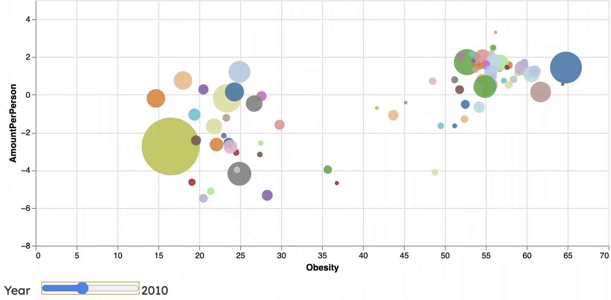

@import "../../lectures/css/datavis.less"

```elm {l=hidden}
import Tidy exposing (..)
import VegaLite exposing (..)
```

# Data Visualization Project Summary

{(whoami|} Daria Rozhnova
daria.rozhnova@city.ac.uk
{|whoami)}

{(task|}

You should complete this datavis project summary document and submit it, along with any necessary supplementary files to **Moodle** by **Sunday 1st May, 5pm UK time**. Submissions will be awarded up to **80 marks** towards your coursework assessment total.

You are also encouraged to regularly commit and push changes to your datavis project throughout the term as you develop your project.

{|task)}

{(questions|}

Current trends have focused on healthy eating and spread of information about improving lifestyle. Coffee is now considered remedy for treating hunger and overeating in many diets. So many researchers have focused their studies on exploration of relation of coffee intake and obesity. However, there is no set conclusion on this beverage and its influence on dieting habits (Lee et al.,2019). In this visualization, we will try to establish pattern between changes in different countries and within over time.

- How did coffee consumption change between 2006 and 2016?
- How did share of obese and overweight adults change over those 10 years?
- What is the relationship between coffee consumption and obesity?

{|questions)}

The data is obtained from multiple sources and merged using Excel and Python. Coffee consumption was collected by merger of two datasets, provided by International Coffee Organization (ICO) Statistics. Obesity and population datasets were obtained from WHO, Global Health Observatory (GHO) and The World Bank.

{(visualization|}

```elm {v interactive}
sliderInteraction : Spec
sliderInteraction =
    let
        data =
            dataFromUrl "https://dariarozhnova.github.io/data/obesityAndCoffee.csv" []
        ps =
            params
                << param "yearSlider"
                [ paValue (num 2010)
                , paBind (ipRange [ inName "Year", inMin 2006, inMax 2016, inStep 1 ])
                ]

        trans =
            transform
                << filter (fiExpr "year(datum.Year) == yearSlider")
            << calculateAs "60 * 1000 * datum.Consumed/datum.Population" "AmountPerPerson"

        encPos =
            encoding
                << position X [ pName "Obesity", pQuant, pScale [ scDomain (doNums [ 0,70 ])]]

                << position Y [ pName "AmountPerPerson", pQuant , pScale [ scDomain (doNums [ 0,35 ])]]


                << color [mName "Country"
                        , mLegend [], mScale [ scScheme "category20" []]]
                << size [ mName "Population", mQuant,
                mScale
                    [ scRange (raNums [ 10, 5000 ])
                    , scType scPow
                    , scExponent 0.87
                        ]
                    , mLegend [ leTitle "Population", leClipHeight 30 ] ]


        toolYear =
            encoding
                << tooltips
                    [ [ tName "Year", tTemporal, tFormat "%Y" ]
                    , [ tName "Population", tTitle "Population" ]
                    , [ tName "Country", tTitle "Country" ]
                    , [ tName "Obesity", tTitle "Obesity, %"]
                    , [ tName "AmountPerPerson", tTitle "Coffee Consumption per capita, kg/year" ]
                    ]

        specYear =
            asSpec
                [ toolYear[], trans []
                , circle
                    [ maInterpolate miMonotone
                    , maPoint (pmMarker [ maFill "black", maStroke "white", maStrokeWidth 1.5 ])
                    , maOpacity 0.9
                    ]
                ]

        specAllYears =
            asSpec
                [ circle
                    [ maInterpolate miMonotone
                    , maSize 1
                    , maOpacity 0
                    ]
                ]

    in
    toVegaLite
        [ width 700
        , height 300
        , data
        , ps[]
        , encPos []
        , layer [ specAllYears, specYear]
        ]

```

{|visualization)}

{(insights|}

Three insights for our analysis are related to the research questions we aim to answer in this project. The analysis will take the following 2-steps structure for each insight:

1.  Observations in a given year (2010)
2.  Observations during year changing (slider moving)

**_*RQ1*_**

We begin with analysis of overall state of coffee consumption in 2010. This allows to observe the differences between countries. For coffee consumption, we explore point distribution along y-axis. The data represented in amount of coffee consumed per capita in a given year. It can be seen that majority of countries do not exceed more than 5 kg per year per person, which is equivalent of 1-2 cups of coffee a day (depending on a country).
We begin by exploring the countries that consume more. By moving the mouse over the circles, we see the information about them, in particular, name of country, population, obesity, amount of coffee consumed and year. The only country that consumes more than 5 kg/pp outside of Europe and grows their own coffee is Brazil, with 5.64 kg/pp. The absolute leader of coffee consumption per capita is Luxembourg, with 27.44 kg/pp. Besides, most of the country-growers consume less than one kilogram of coffee per capita.

Now, moving the slider allows us to observe changes in coffee consumption that happened over the years. We explore countries over and under 5 kg/pp benchmark separately.
On one hand, most countries below benchmark showed little to no change over years. Some exceptions include Hungary, Slovakia, Bulgaria, where consumption varied between 1 kg/pp to 3.5 kg/pp over the years.
On other hand, countries above benchmark showed a lot of change over years. The most commonly observed pattern in these countries is zigzag movement, where the amount falls from 2006 to 2009 and grows from 2014. This can be clearly spotted in Belgium and Sweden, where the consumption fell from around 8.6 kg/pp in both countries to 7kg/pp and 5 kg/pp, respectively, and then grew to 11 kg/pp and 8 kg/pp by 2016. This drastic change was identified in importing countries, but not in coffee growing countries. This can be explained by the financial crisis happening in that period and affecting coffee business along other industries.

Overall, we can say that coffee consumption remained constant for most countries in years between 2006 and 2016. However, some cases of large change can be observed in specific countries in Europe.

**_*RQ2*_**

Similar strategy to first insight is used to analyse the percentage of obese and overweight people in a given year and over time. Now, we observe data point distribution along x-axis. First pattern that can be emerged is that there are two clusters of countries along this axis. These clusters are located between 15% to 30 % and 50% to 65% in 2010.

Using the tooltip interaction, we explore the details of these clusters. We begin with countries where percentages of obese and overweight are lower. Most countries are developing countries from Africa and Asia, with exception of Japan, which is considered developed country. The lowest percentage of obesity,14.7%, is observed in Vietnam.
Second cluster, where percentage of obesity is higher, mostly consists of countries in Europe and Americas. The countries with the highest obesity rates, 64.8% and 64.4%, are United States and Malta, respectively.

Now, we observe the movement of data points over time along x-axis using the slider for yearly change. We can follow the constant change over all countries along the axis to the right, meaning that obesity and overweight percentage increased over the years between 2006 to 2016. Midpoints of same clusters, we observed before, in 2006 at 20% and 53% have moved to 26% and 57% in 2016, respectively.

Overall, some countries have had slower increase than others, however all countries have seen a rise in obesity over years.

**_*RQ3*_**

Lastly, we analyse obesity rates and coffee consumption in relationship to each other. Before we have looked at each axis separately.
Now, we observe all data points with regard to x and y axes in 2010. We spot that there are no countries with high coffee consumption and low obesity percentage. All countries with high coffee intake, of 5 kg/pp, are also in high percentage of obesity cluster.
However, countries with consumption of coffee of less than 5 kg/pp are spread across all rates of obesity. Therefore, it may suggest that there is some positive correlation between amount of coffee consumed and obesity, however this connection may not be strong, and some other factors may be presented. One potential reason for this is that countries with higher coffee consumption also have higher calorie intake due to lifestyle and culture of coffee drinking. For example, a coffee with sweetener and milk contains more calories than a black coffee.

Now, we observe the patterns between obesity and coffee consumption over time. When moving the slider, there is no strong pattern emerging from the visualization.

This suggests that there are factors that may be more influential on obesity levels, such as calorie intake, and on coffee consumption, such as global coffee market fluctuations.

{|insights)}

{(designJustification|}

#### 1. Scatterplot

The design for this project was chosen to be a scatterplot. This tends to provide a clear picture about the possible relationship between coffee consumption and obesity. Scatterplot also allows to compare data points effectively as it uses the position encoding channel, which, according to Roth (2017), is “indispensable” tool to observe the change and to judge the difference. This means that, for example, the user can naturally tell which one of the countries has higher rates of obese and overweight population and to judge by how much one is larger than the other.

Additionally, when the slider is moved from one year value to another, human eye is sharp at catching even the smallest changes in the position on the common scale. However, human ability to compare the changes, when scales or axis vary, falls drastically (Holyoak,1978). Therefore, to ensure the best performance for human in the loop, we fix the axes to be the same for all years. This creates some empty regions for some years. For example, in 2010, we see some empty space in the top of visualization. It could have been scaled down to make the visualization more visually pleasing, however less informative when years are changed.

#### 2. Colour

Colour is used to encode countries. It is applied at random to separate data points on the visualization rather than to group them. According to Munzer (2015), colour is one of the most effective tools for encoding categorical variables. In this project, we do not aim to assign colour to countries in some grouping way, for example, by continent, as some geographical similarities are expected between them. We have seen that all European countries were located in one cluster. Therefore, if all data points were coloured the same it would be very difficult or even impossible to explore the visualization. For instance, in the bottom left corner, we observe that Nepal, Timor and India are closely located. If they were the same colour since all of them are Asian countries, it would make it difficult to navigate and to observe their changes and differences. In this case, we aim to exploit the selective property of colour hue to enhance the differences between countries.

Additionally, we have decreased the opacity, so data points that overlay could be detected easily and not be lost behind some larger circles. For example, there are 5 countries that would be lost behind India if the circles were opaque.
20 categorical colours from standard Vega-Lite package are used to ensure a large range of colours and to avoid further collision of colours.
However, it could not be fully avoided due to large number of countries. Therefore, we still see some data points being merged in colour, such as Nigeria and Thailand in the bottom left corner. Some alternative colour schemes were deployed at construction stage, for example continuous schemes, such as “turbo”, however the results were not visually pleasing and more confusing in some areas.

Lastly, the legend encoding for colour is removed since it is not informative for 89 nominal entries.

#### 3. Interaction

Interaction over our visualisation can be done in two ways.

Firstly, tooltip over each data point provides additional information about year, country, population size, levels of coffee consumption and obesity. It encourages the user to interact and to be in control of visualization, which ensures their engagement. This implements “details-on-demand” aspect according to Schneiderman (1996).

Secondly, “Select and Filter” is provided by a slider to select the specific year and to move to see the changes over years and between countries at the same time. This implements filter aspect of the visualization. This filtering is done using one of the suggested techniques in Vega-Lite (Satyanarayan, 2017), where our response includes only the data points selected interactively for an assigned year.

This allows us to observe multidimensional data in a single visualization and to avoid a clutter.

{|designJustification)}

{(validation|}

#### 1. Scatter vs Map

The preliminary sketch for this project was presented by two choropleth maps (one for coffee consumption and one for obesity). The geographical layout was chosen in this case as it could be natural for human to understand spatial relationship since the subjects are countries (Munzer,2015).
However, we only consider 89 countries, who are members of ICO. This would lead to more than half of all landmass of a map being empty and to have low data-ink ratio (Tufte, 2001). This subconsciously could be perceived as the “empty” countries do not consume coffee, which is not true. As the result, the graphical integrity would suffer, and this visualization would be confusing for a user. Therefore, the final design choice is a scatterplot, which emphasises the possible relationship between coffee consumption and obesity and proves to be more effective tool with respect to our research questions.

Moreover, choropleth maps would use colour as the main tool for comparison of levels of change and difference. According to Franconeri et al (2021), colour encoding would perform worse than position encoding, used in our scatterplot, for precision of estimation. This means that humans cannot estimate the intensity of colour change and differences as well as they can do it for position in space on the common scale.
To further improve the accuracy of judgement and readability for a user, we ensure that all axes start with zero.

#### 2. Human Understanding vs “Prettiness”

One of the obvious limitations of this visualization is the overcrowded space, which is not visually attractive. At the construction stage, we have tried some solutions to overcome this problem, which occurred due to the nature of data.
Therefore, transformation was performed on coffee consumption variable. We have transformed original coffee data, which was recorded in thousands of 60 kg bags, to the variable that would be easier for understanding, kilograms per person. However, the distribution after transformation has remained cluttered.

Firstly, we have added a size encoding, by population. It did not improve our understanding of the visualization with respect to research questions, but it benefited in reduction of overcrowding.

Secondly, the solution that provided us with the desired result was obtained when logarithm was applied to this new variable.


The downside of this “pretty” visualization is that labels on the axis are between -8 and 5. The interpretation would require some calculations, which fails both simplicity and clarity of the visualization (Spingath, 2017). This could lead to overview being confusing for the user and discouraging from further interaction.

As the result, the final decision is made in favour of less aesthetic, but more user-friendly visualization.

#### 3. Further filtering

There exists another solution to the problem of overcrowded space at the bottom of the visualization. Some data points are still inaccessible due to overlay of circles. This could be solved by adding another interaction tool, that would allow user to zoom along x axis. This would provide an opportunity to observe the data points in more detail and avoid overcrowding.
However, this is not added in this project due to lack of coding skills required for this task. It could be included in some future work in order to improve this visualization.

#### Conclusion

To sum up, the visualization presented in this project performs well in answering the research questions. However, some more explorations and improvements can still be made to improve its performance.

{|validation)}

{(references|}

**Lee, A., Lim, W., Kim, S., Khil, H., Cheon, E., & An, S. et al.** (2019). Coffee Intake and Obesity: A Meta-Analysis. Nutrients, 11(6), 1274. https://doi.org/10.3390/nu11061274

**Roth, R.** (2017). Visual Variables. International Encyclopedia Of Geography: People, The Earth, Environment And Technology, 1-11. https://doi.org/10.1002/9781118786352.wbieg0761

**Holyoak, Keith J.** (1978). Comparative judgments with numerical reference points. Cognitive Psychology, 203–243.

**Munzner, T., & Maguire, E.**(2015). Visualization analysis & design. CRC Press. https://go.exlibris.link/9jMy6fQG

**Shneiderman, B.** (1996) The eyes have it: A task by data type taxonomy for information visualization, Proceedings of the IEEE Symposium on Visual Languages, pp.336-343. https://drum.lib.umd.edu/bitstream/handle/1903/5784/TR_96-66.pdf

**Satyanarayan, A., Moritz, D., Wongsuphasawat, K. and Heer, J.** (2017) Vega-Lite: A Grammar of Interactive Graphics. IEEE Transactions on Visualization and Computer Graphics, 23(1) pp. 341-350.

**Tufte, E.** (2001) The Visual Display of Quantitative Information, Graphics Press. https://go.exlibris.link/HRpwwyBl

**Franconeri, S., Padilla, L., Shah, P., Zacks, J. and Hullman, J.** (2021) The science of visual data communication: What works, Psychological Science in the Public Interest, 22(3) pp.110-161.
https://journals.sagepub.com/doi/full/10.1177/15291006211051956

**Spingath, J. (2017).** Design is: Usable and Beautiful. Medium. Retrieved 28 April 2022, from https://blog.prototypr.io/design-is-usable-and-beautiful-d9bbc4471bb3.

{|references)}
